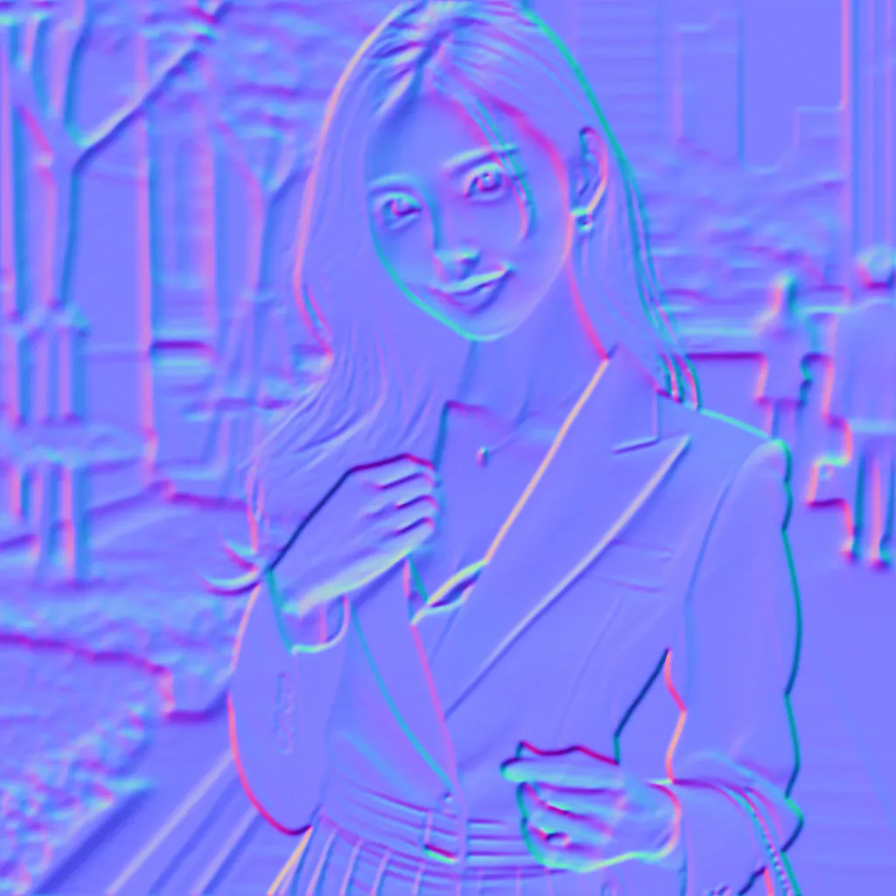

# Advanced Normal Map Generator v3.2

A research-grade normal map processing tool integrating **MiDaS depth estimation**, **edge-based normal reconstruction**, and **image compression pipelines (PNG/WebP/JPEG)**. Designed for consistent normal generation across **vision research**, **graphics experiments**, and **engine-level deployment (Unity/Unreal/DirectX/OpenGL)**.


---
## 🔬 Project Overview
This tool was built for **precise height-to-normal mapping**, **depth-aware material reconstruction**, and **engine-friendly normal output**. It supports both **Computer Vision (CV)** and **Graphics (DCC/CG/Game Dev)** workflows.

Unlike typical normal map generators, this system provides:
- **Full algorithmic control** (Sobel/Scharr/Prewitt edge extraction)
- **Differentiated parameter pipelines** (independent depth/normal preprocessing)
- **MiDaS depth refinement** (depth-to-normal conversion)
- **Green channel orientation control** (OpenGL ⬆️ / DirectX/Unity ⬇️)
- **Standard format output** (PNG/WebP/JPEG compression)


---
## ✨ Key Features
| Feature | Description |
|----------|-------------|
| ✅ Direct normal extraction | From RGB luminance height estimation |
| ✅ MiDaS integration | Depth-to-normal from monocular depth |
| ✅ Independent pipelines | Separate gamma/filters for depth & normal |
| ✅ Noise control | Bilateral/median prefilters |
| ✅ Green Channel Orientation | **OpenGL (Green-Up)** / **DirectX (Green-Down)** |
| ✅ Standard formats | **PNG** / **WebP (Lossless)** / **JPEG** |
| ✅ Batch processing | Multi-file automation |
| ✅ WSL-friendly paths | Automatic Windows path translation |


---
## 🔧 Installation
```bash
git clone https://github.com/ghjghjghkimo/Normal_map_generator.git
cd Normal_map_generator
python -m venv nmgen_env
# Windows
nmgen_env\Scripts\activate
# macOS/WSL/Linux
source nmgen_env/bin/activate
pip install -r requirements.txt
```

---
## 🚀 Launch
```bash
python v3_2.py
```
Open browser: **http://127.0.0.1:7860**

---
## 🎨 Processing Examples

### Example 1: Standard Texture
This example demonstrates the normal map and depth map generation from a standard surface texture.

| Input Image | Normal Map Output | Depth Map Output |
|-------------|-------------------|------------------|
|  |  |  |


**Details:**
- ✅ **Input**: Standard RGB texture (JPG)
- ✅ **Normal Map**: PNG format - Lossless precision for game engines
- ✅ **Depth Map**: WebP format - Compact grayscale representation
- ✅ **Algorithm**: `smooth_sobel` (General-purpose edge detection)
- ✅ **Green Channel**: DirectX/Unity convention (Green Down ⬇️)


---
## 🧭 Normal Space Control
This tool supports **engine-specific normal orientation**:

| Engine | Green Axis | Setting |
|--------|------------|---------|
| Unity / Unreal / DirectX | Green ↓ Down | ✅ Default |
| OpenGL / Vulkan | Green ↑ Up | enable `OpenGL mode` |


---
## 🧱 Output Formats
| Format | Purpose | Notes |
|--------|---------|--------|
| PNG | Standard normal output | ✅ Lossless, recommended |
| WebP (Lossless) | Fast & compact | ⚡ Lossless encoding |
| JPEG | **Not recommended** for normals | ❌ Lossy artifacts |


---
## 🎛 Normal Generation Algorithms
| Algorithm | Behavior | Best Use |
|-----------|----------|----------|
| smooth_sobel | Smoothed Sobel edges | General-purpose |
| sobel | Standard edge detection | Hard surfaces |
| sobel_5 | Larger edge sensitivity | Mid-textures |
| scharr | High gradient contrast | Metals, sci-fi |
| prewitt | Soft gradients | Organic surfaces |


---
## 🧪 Parameter Guide
| Parameter | Description | Range |
|-----------|-------------|--------|
| Normal Strength | Z-axis intensity | 0.001–0.2 |
| Normal Gamma | Shape amplification | 0.1–3.0 |
| Normal Blur/Sharp | Bilateral filter control | -10 to 10 |
| Depth Gamma | MiDaS leveling | 0.1–3.0 |
| Depth Blur/Sharp | Refine depth smoothness | -10 to 10 |


---
## 🛠 Presets
✅ Built-in presets include:
- `標準 (低雜訊)` – Balanced
- `石材專用` – High solidity
- `平滑` – Clean edges
- `銳利` – Maximum detail
- `極致細節` – Feature boost


---
## 🗃 Batch Processing
Supports **batch image generation** with **shared parameter control**. Produces structured output including:
```
mytexture_normal.png
mytexture_depth.png
```


---
## 🧩 WSL Path Support
If using **WSL**, output paths are translated automatically:
```
/mnt/c/Users/<username>/Downloads/normal_maps
```
This makes results visible in **Windows File Explorer**.


---
## 🔒 Image Integrity
✅ WebP export here uses **lossless** mode  
✅ Avoid JPEG for normals (breaks tangent space)  
✅ PNG export keeps **engine-ready vector precision**


---
## 🎯 Quick Start Guide

### Single Image Processing
1. Click **"上傳圖片"** (Upload Image)
2. Select your texture file
3. Choose processing parameters (or use presets)
4. Click **"生成貼圖"** (Generate Map)
5. Download **Normal Map** and **Depth Map**

### Batch Processing
1. Click **"選擇多張圖片"** (Select Multiple Images)
2. Choose multiple texture files at once
3. Configure shared parameters
4. Click **"開始批次處理"** (Start Batch Processing)
5. All results saved with original filenames (`texture_normal.png`, `texture_depth.png`)

### Recommended Settings

**For Smooth Surfaces (Metal, Plastic)**
- Algorithm: `scharr` or `smooth_sobel`
- Strength: 0.008 - 0.012
- Blur/Sharp: -3 to 0

**For Detailed Textures (Stone, Fabric)**
- Algorithm: `prewitt` or `sobel_5`
- Strength: 0.012 - 0.018
- Blur/Sharp: -5 to 2

**For Organic Surfaces (Skin, Wood)**
- Algorithm: `smooth_sobel` (Default)
- Strength: 0.010 - 0.015
- Blur/Sharp: -4 to -1

---
## 📌 Requirements
- Python 3.8+  
- PyTorch (CUDA optional)  
- OpenCV + NumPy + Pillow  
- Gradio UI


---
## 📜 License
MIT License


---
## 🤝 Contribution
PRs welcome — especially improvements for:
- GPU normal refinement
- Depth nonlinearity correction
- Vulkan/Metal oriented normal conventions

---
## ✉️ Research Depth Map to Normal Map
| Depth Map to Normal Map |
|-------------------------|
|  |
---
## ✉️ Contact
For collaboration or engine integration questions, feel free to reach out.

---
> Research utility version — Structured pipeline for depth-assisted normal map synthesis.

